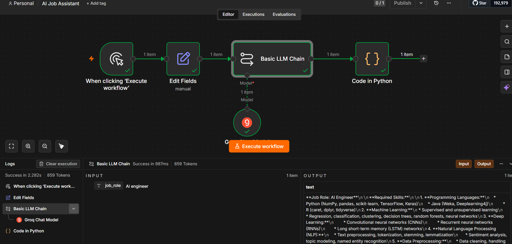

# 🤖 AI Job Assistant — n8n + Groq

An AI-powered Job Assistant built using **n8n Cloud**, **Groq LLM**, and **Python**.

This workflow generates career guidance based on a selected job role and helps users understand skills, roadmap, interview preparation, and resume improvements.

---

## ✨ Features

* AI-generated Career Guidance
* Required Skills Generation
* Learning Roadmap
* Interview Preparation Questions
* Resume Suggestions
* Structured Output using Python Node
* Exportable and Reusable Workflow

---

## 🏗 Workflow Architecture

```text
Manual Trigger
     ↓
Edit Fields
     ↓
Basic LLM Chain
     ↓
Groq Chat Model
     ↓
Code in Python
```

---

## 📌 How It Works

### Input

Example:

```text
AI Engineer
```

### Process

1. User enters a job role
2. n8n passes the input to Basic LLM Chain
3. Groq generates AI-based career guidance
4. Python formats the final output

### Output Example

```text
Job Role: AI Engineer

Required Skills:
• Python
• Machine Learning
• Deep Learning
• NLP

Learning Roadmap:
Phase 1 → Fundamentals
Phase 2 → Projects
Phase 3 → Specialization

Interview Questions:
• Explain supervised learning
• Difference between CNN and RNN

Resume Tips:
• Showcase projects
• Include measurable results
```

---

## 🛠 Tech Stack

| Technology | Purpose                |
| ---------- | ---------------------- |
| n8n Cloud  | Workflow Automation    |
| Groq API   | AI Response Generation |
| Python     | Output Processing      |
| GitHub     | Version Control        |

---

## 📂 Repository Structure

```text
/
├── README.md
├── AI_Job_Assistant_Groq.json
```

---

## 🚀 Setup Guide

### 1. Clone Repository

```bash
git clone <your-repository-url>
```

### 2. Import Workflow

Open n8n → Import Workflow → Select:

```text
AI_Job_Assistant_Groq.json
```

### 3. Configure Credentials

Add your:

```text
Groq API Key
```

### 4. Execute Workflow

Provide a job role and generate results.

---

## 🎯 Example Roles to Try

* AI Engineer
* Data Analyst
* Frontend Developer
* Backend Developer
* Machine Learning Engineer
* Cloud Engineer
* Cybersecurity Analyst

---

## 📸 Workflow Screenshot



---

## 📚 Learning Outcomes

This project helped me learn:

* Workflow Automation
* Prompt Engineering
* AI Integration
* Python in n8n
* API Configuration
* GitHub Publishing

---
